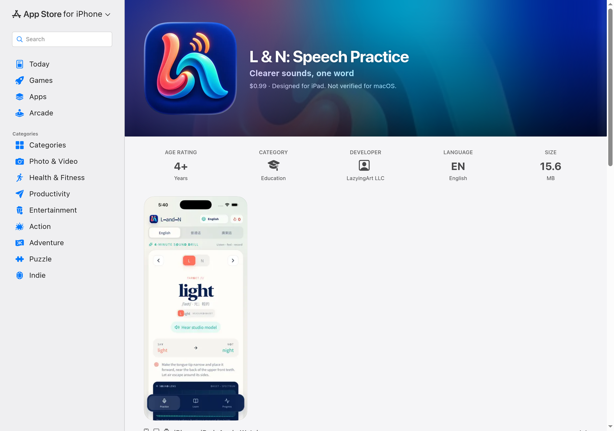
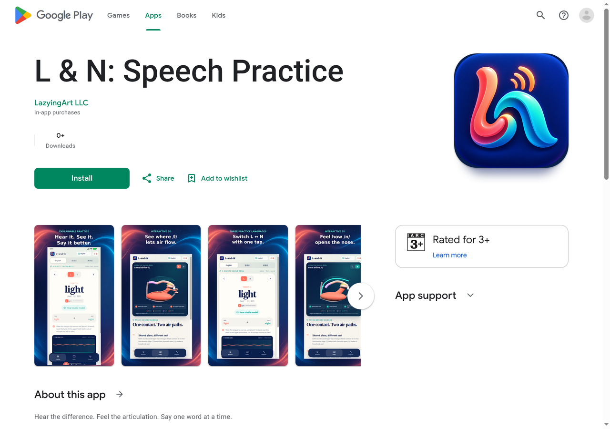

[English](README.md) · [العربية](i18n/README.ar.md) · [Español](i18n/README.es.md) · [Français](i18n/README.fr.md) · [日本語](i18n/README.ja.md) · [한국어](i18n/README.ko.md) · [Tiếng Việt](i18n/README.vi.md) · [中文 (简体)](i18n/README.zh-Hans.md) · [中文（繁體）](i18n/README.zh-Hant.md) · [Deutsch](i18n/README.de.md) · [Русский](i18n/README.ru.md)


# L-and-N

**A calm, evidence-aware pronunciation coach for hearing and producing L and N.**

[Open the live PWA](https://l-and-n.lazying.art) · [Try the light/night mini-lesson](https://l-and-n.lazying.art/lessons/light-vs-night/) · [Custom lessons for tutors](https://l-and-n.lazying.art/for-tutors/) · [Privacy](https://l-and-n.lazying.art/privacy.html) · [Support](https://l-and-n.lazying.art/support.html) · [Research notes](docs/research/pronunciation-assessment.md)

[Download on the App Store](https://apps.apple.com/us/app/l-n-speech-practice/id6808872450) · [TestFlight for iPhone + Apple Watch](https://testflight.apple.com/join/CpkT8m9C) · [Get it on Google Play](https://play.google.com/store/apps/details?id=art.lazying.landn) · [Signed Android test APK, build 11](https://l-and-n.lazying.art/downloads/L-and-N-1.0.3-build11-test.apk)

<p align="center"><a href="https://apps.apple.com/us/app/l-n-speech-practice/id6808872450"></a> <a href="https://play.google.com/store/apps/details?id=art.lazying.landn"></a></p>

The web app is free and needs no account. On Google Play the app installs free with the first three pairs of each language open and a one-time US$0.99 purchase for the full curriculum; on the App Store it is US$0.99 (CNY 8, HKD 8) up front.

L-and-N turns a small but frustrating speech contrast into a short practice loop: see the letter inside the word, hear a studio model, watch the signal, record, and receive an explained score. The same curriculum runs as an installable PWA, Android app, iPhone/iPad app, and a compact watchOS drill.


## What it does

- Trains 31 minimal pairs: 16 English (light/night, line/nine, lead/need …), 8 Mandarin (蓝/南, 里/你, 龙/农 …) and 7 Cantonese (你/理, 男/藍, 腦/老 …), each with cues in every interface language.
- Highlights the target letter or Han character and gives a plain-language tongue/airflow cue.
- Bundles studio audio generated at release time with one native neural voice per language and verified by a recognizer and the app's own onset model (`tools/audio/synthesize_word_clips.py`), so listening never depends on a live TTS service. The studio example says the word twice; the exam concatenates verified single-word clips.
- Trains the ear as well as the mouth: the Listen tab plays a random run of one minimal pair, such as “light night light light night”, in rounds of 3, 5 or 7 words, and you tap the word you heard at each position before submitting. Method and limits: [docs/research/listening-exam.md](docs/research/listening-exam.md)
- Shows a live waveform and onset spectrum for signal feedback—not as a decorative “correctness” meter.
- Offers an interactive 3D mouth cutaway for L-side airflow and N-nasal airflow. It models the target gesture; it does not claim to reconstruct the learner's tongue.
- Keeps attempts and cautious personal calibration on the device. Mandarin/Cantonese pitch shape is scored separately from consonant identity.

## A score you can inspect

The recognizer decides which word was said: if it heard the paired word, the score is capped and says so. The scorer then finds the voiced onset, checks recording quality, and runs a small on-device neural network (about nine thousand parameters, plain TypeScript, no download) over the first 300 ms to judge whether the onset was lateral or nasal. The network was trained on more than eleven thousand real /l/ and /n/ word onsets cut from lecture recordings with Whisper word timestamps and reaches about 89 % on unseen recordings; the older hand-tuned spectral cues (low-band energy, an A1–P0 proxy, F1/F2 spacing, tilt) now only nudge it. Weak or contradictory evidence lowers confidence and asks for another attempt. Details and limits: [docs/research/onset-model.md](docs/research/onset-model.md).

This is a coaching signal, not a diagnosis or a certified accent judgment. A waveform reveals silence, clipping, and timing, but cannot prove which consonant was spoken. Audio alone also cannot uniquely recover tongue position. The design and limitations are documented in [the research report](docs/research/pronunciation-assessment.md), with links to the L/N, GOP/CTC, tone, visual-biofeedback, and articulatory-inversion literature.

## Privacy and speech services

Acoustic features, scores, progress, and calibration run locally. On iOS, one native audio-engine stream supplies the waveform, local acoustic analysis, and operating-system speech recognition together; the app does not compete with itself for the microphone. The hosted PWA normally tries compatible browser speech recognition first; the browser or platform may process that recognition through its own service. On iPhone and iPad web, L & N instead records one stream so the waveform and recorder do not compete, then transcribes that same short clip after the user stops. When browser recognition is unavailable, fails, or returns no text, an attempt may be sent transiently through a same-origin, rate-limited gateway to the private Whisper service for a word-level cross-check. The gateway accepts only the exact transcription route from this origin, limits size and concurrency, does not log or store audio, and returns `Cache-Control: no-store`. If transcription is unavailable, the waveform remains visible but no score is displayed or saved.

The public browser never receives LazyEdge credentials and never connects directly to the private model service. All packaged studio examples are static audio assets generated and intelligibility-checked at release time.

## Platforms and verified builds

| Platform | Implementation | Verification |
| --- | --- | --- |
| Web/PWA | React 19, TypeScript, Vite, Workbox | Responsive Chromium flow, offline precache, microphone/scoring flow |
| Android | Capacitor 8 | API 36.1 emulator build/install/launch, recording result, 3D model, bundled audio |
| iOS | Capacitor 8 + native AVAudioEngine recorder | iPhone 17 Pro simulator build/install/launch; embedded watch and recorder integration compiled (physical-device microphone check still required) |
| watchOS | SwiftUI | Apple Watch Series 11 (42 mm) simulator build/install/launch |

<p align="center">  </p>

## Build and test

Requirements: Node.js 22+, npm, Android Studio/JDK 21 for Android, and Xcode plus XcodeGen for Apple targets.

```bash
npm install
npm run check
npm run dev
npm run cap:sync
cd android && ./gradlew testDebugUnitTest assembleDebug
cd ../watch && xcodegen generate && xcodebuild -project LAndNWatch.xcodeproj -scheme LAndNWatch -sdk watchsimulator build
```

Capacitor generates the native web bundles from `dist/`. The small SwiftUI watch target is embedded into the iOS app for distribution and can still be built independently for simulator development. Deployment-specific secrets and runtime state are excluded; [the gateway source](ops/landn_gateway.py) reads its short-scope speech token from a protected file.

## Curriculum and evidence

The initial English set follows the articulatory teaching sequence and minimal pairs in Pronunciation Snippets' [“The Difference Between L & N”](https://youtu.be/78RQW1Kq_3A). This repository contains a timestamped paraphrase, not the source video, audio, or full captions. Mandarin and Cantonese drills are original additions. Cantonese contrast practice is explicitly optional: widespread Hong Kong /n/→[l] variation is not labelled defective speech.

No large expert-rated, cross-device corpus currently validates this release across all three language varieties. A production accuracy claim would require held-out precision/recall, calibration error, regional and device breakdowns, and the rate at which the system declines to score. Contributions of consented data protocols, phone-level CTC/GOP models, and accessibility review are welcome.

## Project structure

- `src/` — curriculum, audio analysis, explainable scoring, signal display, and 3D model.
- `public/audio/models/` — bundled, intelligibility-checked studio prompts.
- `android/`, `ios/`, `watch/` — native wrappers and the embedded SwiftUI watch companion.
- `store/` — versioned store metadata, privacy declarations, assets, and release status.
- `ops/` — minimal, dependency-free Whisper gateway and tests.
- `docs/` — research, lesson provenance, and simulator evidence.

## Support

If this free project is useful, a star, issue, translation, or carefully scoped pull request helps. Financial support funds hosting and accessibility work.

| Donate | PayPal | Stripe |
| --- | --- | --- |
| [LazyingArt Donate](https://chat.lazying.art/donate) | [paypal.me/RongzhouChen](https://paypal.me/RongzhouChen) | [Support with Stripe](https://buy.stripe.com/aFadR8gIaflgfQV6T4fw400) |

[Sponsor on GitHub](https://github.com/sponsors/lachlanchen)

## Citation and license

Citation metadata is available in [`CITATION.cff`](CITATION.cff). A compact BibTeX form is:

```bibtex
@software{chen2026landn,
  author = {Lachlan Chen},
  title = {L-and-N: a transparent pronunciation coach},
  year = {2026},
  version = {1.0.0},
  url = {https://github.com/lachlanchen/L-and-N}
}
```

Released under the [MIT License](LICENSE). The generated voice examples are provided as application demonstration assets; do not use them to impersonate a real person.
