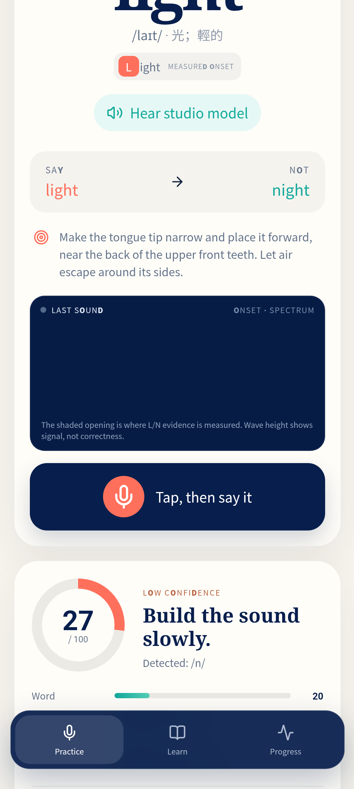
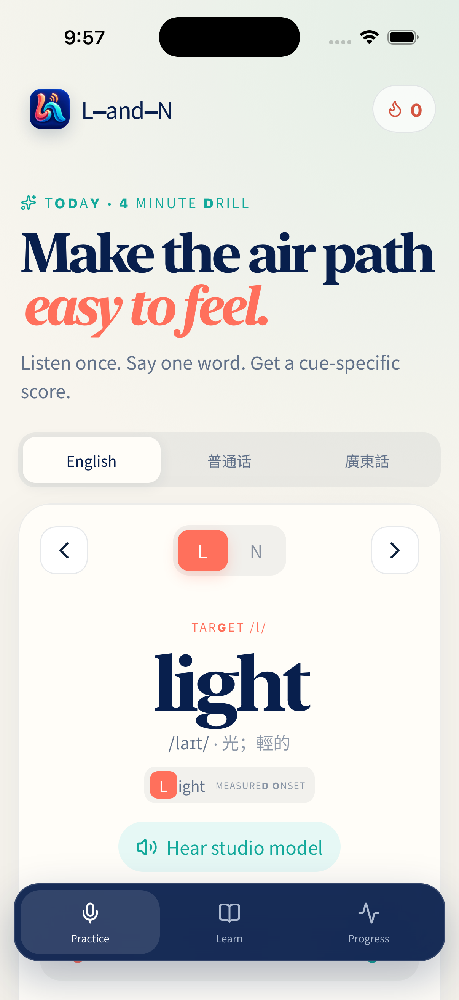
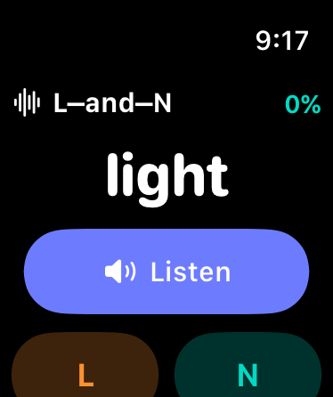

[English](README.md) · [العربية](i18n/README.ar.md) · [Español](i18n/README.es.md) · [Français](i18n/README.fr.md) · [日本語](i18n/README.ja.md) · [한국어](i18n/README.ko.md) · [Tiếng Việt](i18n/README.vi.md) · [中文 (简体)](i18n/README.zh-Hans.md) · [中文（繁體）](i18n/README.zh-Hant.md) · [Deutsch](i18n/README.de.md) · [Русский](i18n/README.ru.md)

[](https://github.com/lachlanchen/lachlanchen/blob/main/figs/banner.png)

[](https://l-and-n.lazying.art) [](https://github.com/sponsors/lachlanchen)

# L-and-N

**A calm, evidence-aware pronunciation coach for hearing and producing L and N.**

[App Store — US$0.99](https://apps.apple.com/us/app/l-n-speech-practice/id6808872450) · [Google Play — free download, in-app purchases](https://play.google.com/store/apps/details?id=art.lazying.landn) · [Official links](docs/public-links.md)

[Open the live PWA](https://l-and-n.lazying.art) · [Try the light/night mini-lesson](https://l-and-n.lazying.art/lessons/light-vs-night/) · [Custom lessons for tutors](https://l-and-n.lazying.art/for-tutors/) · [Privacy](https://l-and-n.lazying.art/privacy.html) · [Support](https://l-and-n.lazying.art/support.html) · [Research notes](docs/research/pronunciation-assessment.md)

<p align="center"><a href="https://apps.apple.com/us/app/l-n-speech-practice/id6808872450"></a> <a href="https://play.google.com/store/apps/details?id=art.lazying.landn"></a></p>

The web app is free and needs no account. On Google Play the app installs free with the first three pairs of each language open and a one-time US$0.99 purchase for the full curriculum; on the App Store it is US$0.99 (CNY 8, HKD 8) up front.

L-and-N turns a small but frustrating speech contrast into a short practice loop: see the letter inside the word, hear a studio model, watch the signal, record, and receive an explained score. The same curriculum runs as an installable PWA, Android app, iPhone/iPad app, and a compact watchOS drill.

## 12 UI languages, three practice languages

The current source supports the 11 profile UI languages below, plus Cantonese. Menus, Learn principles, model labels, score feedback, privacy/purchase messages and all 118 word meanings are localized. The eight added languages use concise L/N coaching cues with relevant tone and ending guidance. Changing UI language does not change practice words, audio or scoring. Arabic has right-to-left layout. Native store availability follows the release receipts; the separate watch companion is not expanded by this change.

English · العربية · Español · Français · 日本語 · 한국어 · Tiếng Việt · 简体中文 · 繁體中文 · Deutsch · Русский · 廣東話

[12 UI languages, three practice languages](docs/LOCALIZATION.md)

## Watch the app

English demo · subtitled

<video src="https://github.com/user-attachments/assets/036ebbdf-ab34-4761-875e-46470074aff8" controls width="320"></video>

中文演示 · Chinese demo · subtitled

<video src="https://github.com/user-attachments/assets/f13a2ea0-ca16-4d40-8f3b-478e5b5e7792" controls width="320"></video>


## What it does

- Trains 59 minimal pairs: 16 English, 22 Mandarin and 21 Cantonese, with localized meanings and coaching cues.
- Highlights the target letter or Han character and gives a plain-language tongue/airflow cue.
- Bundles studio audio generated at release time with one native neural voice per language and verified by a recognizer and the app's own onset model (`tools/audio/synthesize_word_clips.py`), so listening never depends on a live TTS service. The studio example says the word twice; the exam concatenates verified single-word clips.
- Trains the ear as well as the mouth: the Listen tab plays a random run of one minimal pair, such as “light night light light night”, in rounds of 3, 5 or 7 words, and you tap the word you heard at each position before submitting. Method and limits: [docs/research/listening-exam.md](docs/research/listening-exam.md)
- Shows a live waveform and onset spectrum for signal feedback—not as a decorative “correctness” meter.
- Offers an interactive 3D mouth cutaway for L-side airflow and N-nasal airflow. It models the target gesture; it does not claim to reconstruct the learner's tongue.
- Keeps attempts and cautious personal calibration on the device. Mandarin/Cantonese pitch shape is scored separately from consonant identity.

## A score you can inspect

The recognizer determines the word; hearing its paired word caps the score with an explanation. A small on-device network (about nine thousand parameters) examines the first 300 ms for lateral/nasal evidence. Trained on over eleven thousand /l/ and /n/ lecture-recording onsets, it reached about 89% on held-out recordings—not validated accuracy for every phone or accent. Spectral cues make only small adjustments; weak or conflicting evidence lowers confidence. [Model evidence and limits](docs/research/onset-model.md).

This is a coaching signal, not a diagnosis or a certified accent judgment. A waveform reveals silence, clipping, and timing, but cannot prove which consonant was spoken. Audio alone also cannot uniquely recover tongue position. The design and limitations are documented in [the research report](docs/research/pronunciation-assessment.md), with links to the L/N, GOP/CTC, tone, visual-biofeedback, and articulatory-inversion literature.

## Privacy and speech services

Acoustics, scores, progress and calibration run locally. iOS shares one native audio stream between waveform, analysis and system recognition. The PWA normally tries browser recognition, whose provider may process audio online. iPhone/iPad web records one stream and transcribes it after stopping. Unavailable, failed or empty recognition may send the short clip transiently through a same-origin, rate-limited gateway to private Whisper. It permits only the transcription route, limits size/concurrency and neither logs nor stores audio (`Cache-Control: no-store`). Without transcription, the waveform remains available but no score is shown or saved.

The public browser never receives LazyEdge credentials and never connects directly to the private model service. All packaged studio examples are static audio assets generated and intelligibility-checked at release time.

## Platforms and verified builds

| Platform | Implementation | Verification |
| --- | --- | --- |
| Web/PWA | React 19, TypeScript, Vite, Workbox | Responsive Chromium flow, offline precache, microphone/scoring flow |
| Android | Capacitor 8 | API 36.1 emulator build/install/launch, recording result, 3D model, bundled audio |
| iOS | Capacitor 8 + native AVAudioEngine recorder | iPhone 17 Pro simulator build/install/launch; embedded watch and recorder integration compiled (physical-device microphone check still required) |
| watchOS | SwiftUI | Apple Watch Series 11 (42 mm) simulator build/install/launch |

For beta testing only: [TestFlight for iPhone + Apple Watch](https://testflight.apple.com/join/CpkT8m9C). For everyday practice, use the production-store links above.

<p align="center">  </p>

## Build and test

Requirements: Node.js 22+, npm, Android Studio/JDK 21 for Android, and Xcode plus XcodeGen for Apple targets.

```bash
npm install
npm run check
npm run dev
npm run cap:sync
cd android && ./gradlew testDebugUnitTest assembleDebug
cd ../watch && xcodegen generate && xcodebuild -project LAndNWatch.xcodeproj -scheme LAndNWatch -sdk watchsimulator build
```

Capacitor generates the native web bundles from `dist/`. The small SwiftUI watch target is embedded into the iOS app for distribution and can still be built independently for simulator development. Deployment-specific secrets and runtime state are excluded; [the gateway source](ops/landn_gateway.py) reads its short-scope speech token from a protected file.

## Curriculum and evidence

The initial English set follows the articulatory teaching sequence and minimal pairs in Pronunciation Snippets' [“The Difference Between L & N”](https://youtu.be/78RQW1Kq_3A). This repository contains a timestamped paraphrase, not the source video, audio, or full captions. Mandarin and Cantonese drills are original additions. Cantonese contrast practice is explicitly optional: widespread Hong Kong /n/→[l] variation is not labelled defective speech.

No large expert-rated, cross-device corpus currently validates this release across all three language varieties. A production accuracy claim would require held-out precision/recall, calibration error, regional and device breakdowns, and the rate at which the system declines to score. Contributions of consented data protocols, phone-level CTC/GOP models, and accessibility review are welcome.

## Project structure

- `src/` — curriculum, audio analysis, explainable scoring, signal display, and 3D model.
- `public/audio/models/` — bundled, intelligibility-checked studio prompts.
- `android/`, `ios/`, `watch/` — native wrappers and the embedded SwiftUI watch companion.
- `store/` — versioned store metadata, privacy declarations, assets, and release status.
- `ops/` — minimal, dependency-free Whisper gateway and tests.
- `docs/` — research, lesson provenance, and simulator evidence.

## Support

If this free project is useful, a star, issue, translation, or carefully scoped pull request helps. Financial support funds hosting and accessibility work.

| Donate | PayPal | Stripe |
| --- | --- | --- |
| [](https://chat.lazying.art/donate) | [](https://paypal.me/RongzhouChen) | [](https://buy.stripe.com/aFadR8gIaflgfQV6T4fw400) |

[](https://github.com/sponsors/lachlanchen)

## Citation and license

Citation metadata is available in [`CITATION.cff`](CITATION.cff). A compact BibTeX form is:

```bibtex
@software{chen2026landn,
  author = {Lachlan Chen},
  title = {L-and-N: a transparent pronunciation coach},
  year = {2026},
  version = {1.0.0},
  url = {https://github.com/lachlanchen/L-and-N}
}
```

Released under the [MIT License](LICENSE). The generated voice examples are provided as application demonstration assets; do not use them to impersonate a real person.
