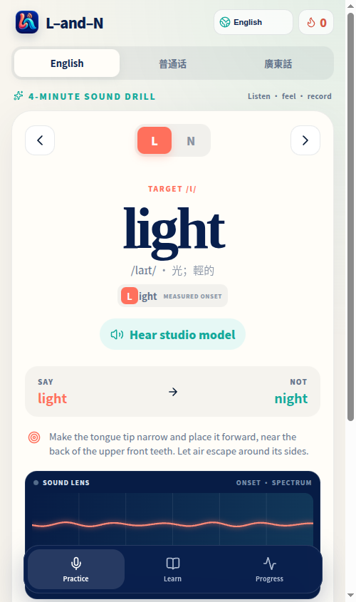
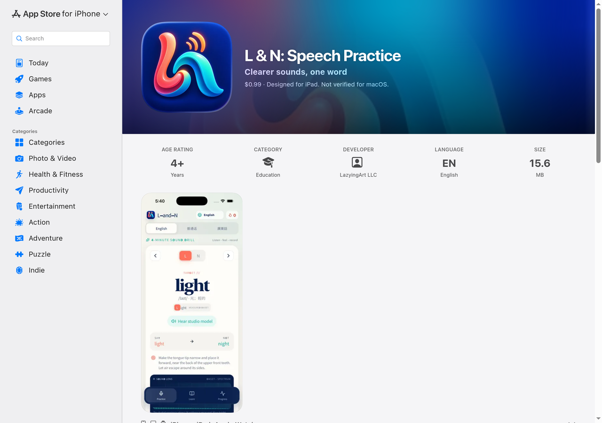
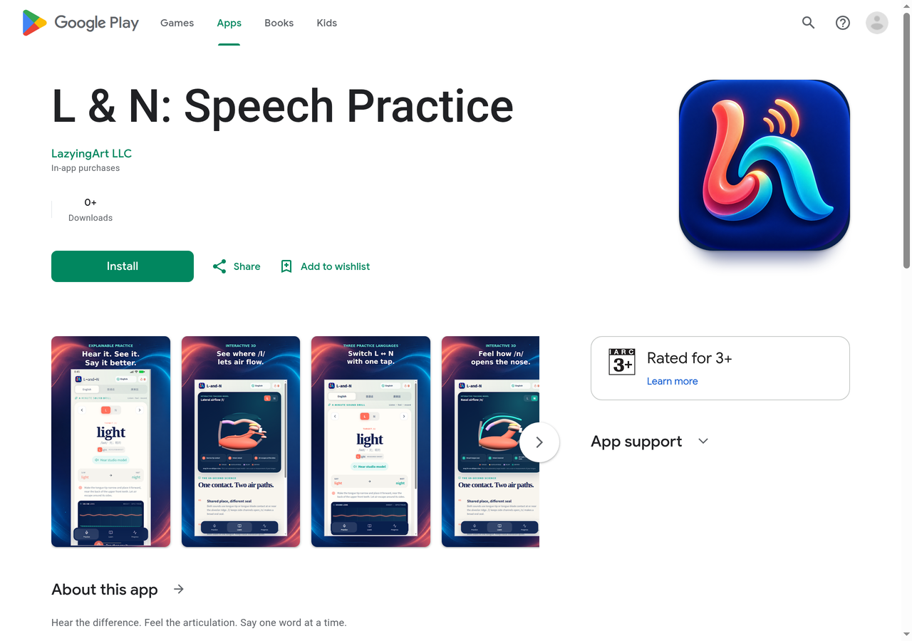

[English](../README.md) · [العربية](README.ar.md) · [Español](README.es.md) · [Français](README.fr.md) · [日本語](README.ja.md) · [한국어](README.ko.md) · [Tiếng Việt](README.vi.md) · [中文 (简体)](README.zh-Hans.md) · [中文（繁體）](README.zh-Hant.md) · [Deutsch](README.de.md) · [Русский](README.ru.md)

[](https://github.com/lachlanchen/lachlanchen/blob/main/figs/banner.png)

[](https://l-and-n.lazying.art) [](https://github.com/sponsors/lachlanchen)

# L-and-N

**Un coach de prononciation calme et transparent pour entendre et produire L et N.**

[Ouvrir la PWA](https://l-and-n.lazying.art) · [Notes de recherche](../docs/research/pronunciation-assessment.md) · [Plan de la leçon](../docs/source-lesson.md)

[App Store — 0,99 $ US](https://apps.apple.com/us/app/l-n-speech-practice/id6808872450) · [Google Play — téléchargement gratuit, achats intégrés](https://play.google.com/store/apps/details?id=art.lazying.landn) · [Liens officiels](../docs/public-links.md)

L-and-N transforme un contraste difficile en une boucle courte : voir la lettre ou le caractère dans le mot, écouter un modèle enregistré, observer le signal, s'enregistrer et lire un score expliqué. Le même cours fonctionne comme PWA installable, application Android, application iPhone/iPad et exercice watchOS compact.



<p align="center"><a href="https://apps.apple.com/us/app/l-n-speech-practice/id6808872450"></a> <a href="https://play.google.com/store/apps/details?id=art.lazying.landn"></a></p>

## 12 langues d’interface, trois langues de pratique

Le code actuel prend en charge les 11 langues du profil ci-dessous, plus le cantonais. Menus, principes, étiquettes du modèle, retours, messages de confidentialité/achat et sens des 118 mots sont traduits. Les huit langues ajoutées emploient des conseils L/N concis avec les tons et finales pertinents. Changer l’interface ne change ni mots, ni audio, ni évaluation. L’arabe s’affiche de droite à gauche. Les reçus de publication indiquent la disponibilité native ; ce changement n’étend pas l’application montre distincte.

English · العربية · Español · Français · 日本語 · 한국어 · Tiếng Việt · 简体中文 · 繁體中文 · Deutsch · Русский · 廣東話

[12 langues d’interface, trois langues de pratique](../docs/LOCALIZATION.md)

## Voir l’application

English · 中文

<video src="https://github.com/user-attachments/assets/036ebbdf-ab34-4761-875e-46470074aff8" controls width="320"></video>

<video src="https://github.com/user-attachments/assets/f13a2ea0-ca16-4d40-8f3b-478e5b5e7792" controls width="320"></video>

## Fonctionnalités

- 59 paires minimales : 16 anglaises, 22 en mandarin et 21 en cantonais, avec sens et conseils traduits.
- Met en évidence la lettre ou le caractère cible et explique simplement la position de la langue et le flux d'air.
- Des modèles GPT-SoVITS anglais et des voix chinoises natives sont intégrés ; leur écoute ne dépend pas d'un service TTS en ligne.
- L'onde en direct et le spectre d'attaque montrent silence, saturation et timing, sans prétendre être une jauge de « justesse ».
- Une coupe buccale 3D interactive illustre l'air latéral de L et l'air nasal de N. C'est un modèle du geste cible, pas une reconstruction de la langue de l'apprenant depuis le micro.
- Les essais et la calibration personnelle prudente restent sur l'appareil ; le ton chinois est évalué séparément de la consonne.

## Un score vérifiable

Le reconnaisseur détermine le mot : s’il entend le mot opposé, le score est plafonné et expliqué. L’analyse trouve le début voisé, vérifie la qualité et utilise un petit réseau local (environ neuf mille paramètres) sur les 300 premières ms pour distinguer une attaque latérale ou nasale. Entraîné sur plus de onze mille attaques /l/ et /n/ de cours enregistrés, il atteint environ 89 % sur des enregistrements absents de l’entraînement. Les anciens indices spectraux n’apportent qu’un léger ajustement ; des preuves faibles ou contradictoires réduisent la confiance. Ce n’est pas une précision validée pour chaque téléphone ou accent. [Détails du modèle](../docs/research/onset-model.md).

Ce retour sert à s'entraîner : ce n'est ni un diagnostic, ni un jugement d'accent, ni une mesure certifiée. Une onde révèle timing et saturation mais ne prouve pas une consonne, et l'audio ne permet pas de retrouver une position unique de langue. Le [rapport de recherche](../docs/research/pronunciation-assessment.md) explique méthode et limites avec les travaux sur L/N, GOP/CTC, tons, retour visuel et inversion articulatoire.

## Vie privée et services vocaux

Les caractéristiques acoustiques, les scores, la progression et la calibration sont traités localement. Sur iOS, un seul flux du moteur audio natif alimente à la fois la forme d'onde, l'analyse acoustique locale et la reconnaissance vocale du système ; l'application ne se dispute donc pas le microphone avec elle-même. La PWA hébergée essaie normalement d'abord la reconnaissance vocale compatible du navigateur ; le navigateur ou la plateforme peuvent la traiter au moyen de leur propre service. Sur le Web avec iPhone et iPad, l'application n'enregistre qu'un flux afin que la forme d'onde et l'enregistreur ne se disputent pas le microphone, puis transcrit ce même court extrait après l'arrêt. Si la reconnaissance du navigateur est indisponible, échoue ou ne renvoie aucun texte, une tentative peut être envoyée brièvement, par une passerelle de même origine à débit limité, au service Whisper privé. La passerelle n'accepte que le chemin de transcription exact depuis cette origine, limite la taille et la concurrence, ne journalise ni ne stocke l'audio et répond `Cache-Control: no-store`. Sans transcription, la forme d'onde reste visible, mais aucun score n'est affiché ni enregistré.

Le navigateur ne reçoit aucun secret LazyEdge et ne contacte pas directement le modèle privé. Tous les exemples sont des ressources statiques produites et vérifiées lors de la version.

## Plateformes et builds vérifiés

| Plateforme | Réalisation | Vérification |
| --- | --- | --- |
| Web/PWA | React 19, TypeScript, Vite, Workbox | Chromium adaptatif, cache hors-ligne, enregistrement et score |
| Android | Capacitor 8 | Émulateur API 36.1 : build, installation, résultat, 3D et audio intégré |
| iOS | Capacitor 8 + enregistreur AVAudioEngine natif | Simulateur iPhone 17 Pro : build, installation et lancement ; intégration de l'enregistreur et Watch embarquée compilées (test micro sur appareil physique restant) |
| watchOS | SwiftUI | Simulateur Apple Watch Series 11 (42 mm) : build, installation et lancement |

## Construire et tester

Prérequis : Node.js 22+, npm, Android Studio/JDK 21 pour Android, Xcode et XcodeGen pour Apple.

```bash
npm install
npm run check
npm run dev
npm run cap:sync
cd android && ./gradlew testDebugUnitTest assembleDebug
cd ../watch && xcodegen generate && xcodebuild -project LAndNWatch.xcodeproj -scheme LAndNWatch -sdk watchsimulator build
```

Capacitor produit les paquets web natifs depuis `dist/`. La montre est une petite cible SwiftUI indépendante. Secrets et état d'exécution sont exclus ; [la passerelle](../ops/landn_gateway.py) lit son jeton restreint dans un fichier protégé.

## Cours et preuves

Le premier ensemble anglais suit la progression articulatoire et les paires minimales de [« The Difference Between L & N »](https://youtu.be/78RQW1Kq_3A) par Pronunciation Snippets. Le dépôt contient une paraphrase horodatée, pas la vidéo, l'audio ou les sous-titres complets. Mandarin et cantonais sont des ajouts originaux. L'exercice cantonais est facultatif : la variation /n/→[l], courante à Hong Kong, n'est pas qualifiée de défaut ou de parole « paresseuse ».

Il n'existe pas encore de grand corpus évalué par des spécialistes et multi-appareils couvrant les trois variétés. Une annonce de précision en production exigerait précision/rappel sur données réservées, erreur de calibration, ventilation région/appareil et taux d'abstention. Les protocoles consentis, modèles CTC/GOP par phonème et audits d'accessibilité sont bienvenus.

## Structure du projet

- `src/` — cours, analyse, score explicable, signal et modèle 3D.
- `public/audio/models/` — exemples de studio intégrés et vérifiés.
- `android/`, `ios/`, `watch/` — enveloppes natives et app SwiftUI.
- `ops/` — passerelle Whisper minimale sans dépendance et tests.
- `docs/` — recherche, provenance et preuves des simulateurs.

## Soutien

Si ce projet libre vous aide, une étoile, un ticket, une traduction ou une PR bien cadrée sont précieux. Les dons financent l'hébergement et l'accessibilité.

| Donate | PayPal | Stripe |
| --- | --- | --- |
| [](https://chat.lazying.art/donate) | [](https://paypal.me/RongzhouChen) | [](https://buy.stripe.com/aFadR8gIaflgfQV6T4fw400) |

[](https://github.com/sponsors/lachlanchen)

## Citation et licence

Les métadonnées sont dans [`CITATION.cff`](../CITATION.cff). Forme BibTeX courte :

```bibtex
@software{chen2026landn,
  author = {Lachlan Chen},
  title = {L-and-N: a transparent pronunciation coach},
  year = {2026},
  version = {1.0.0},
  url = {https://github.com/lachlanchen/L-and-N}
}
```

Publié sous [MIT License](../LICENSE). Les voix générées sont des ressources de démonstration et ne doivent pas servir à usurper l'identité d'une personne.
