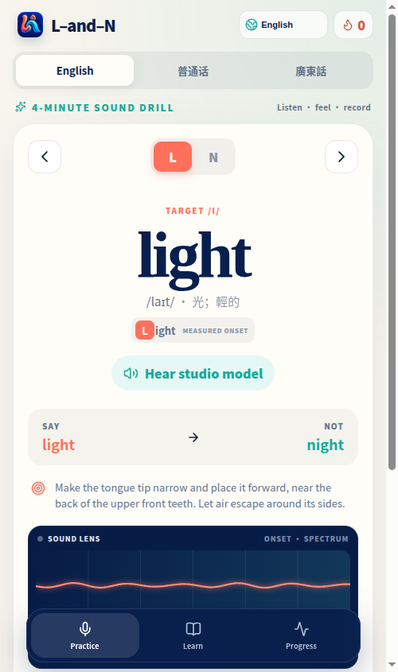

[English](../README.md) · [العربية](README.ar.md) · [Español](README.es.md) · [Français](README.fr.md) · [日本語](README.ja.md) · [한국어](README.ko.md) · [Tiếng Việt](README.vi.md) · [中文 (简体)](README.zh-Hans.md) · [中文（繁體）](README.zh-Hant.md) · [Deutsch](README.de.md) · [Русский](README.ru.md)


# L-and-N

**L と N を聞き分け、発音するための、穏やかで根拠が見える発音コーチです。**

[PWA を開く](https://l-and-n.lazying.art) · [研究ノート](../docs/research/pronunciation-assessment.md) · [元レッスン対応表](../docs/source-lesson.md)

L-and-N は、難しい音の対立を短い練習サイクルにします。単語中の文字や漢字を見て、収録済みの手本を聞き、信号を確認し、自分の声を録音して、説明付きの結果を読みます。同じ教材をインストール可能な PWA、Android、iPhone/iPad、コンパクトな watchOS ドリルで利用できます。



## できること

- 英語 10 組・20 語のミニマルペアと、独自の普通話・広東語練習を収録しています。
- 対象文字や漢字を強調し、舌の位置と空気の流れを平易な言葉で示します。
- 英語 GPT-SoVITS と中国語ネイティブ音声をアプリに同梱し、再生時にオンライン TTS は不要です。
- ライブ波形と開始部スペクトルは無音、クリッピング、タイミングを確認するためのものです。見栄えだけの正答メーターにはしません。
- 対話型 3D 口腔断面は L の側面気流と N の鼻腔気流を示します。目標動作の模型であり、マイクから学習者の舌を復元するものではありません。
- 記録と慎重な個人較正は端末内に保存し、中国語の声調は子音と別に採点します。

## 根拠を確認できるスコア

端末内スコアラーは有声開始点と録音品質を調べ、低域の鼻音エネルギー、A1–P0 型の代理値、おおよその F1/F2 間隔、スペクトル傾斜、連続性、提示語の認識、ミニマルペアの結果を組み合わせます。言語ごとの参照プロファイルを使い、複数回の良質な録音がある場合だけ個人基準を慎重に調整します。証拠が弱い、または矛盾するときは信頼度を下げ、再録音を促します。

これは練習用フィードバックであり、診断、訛りの判定、認証された測定ではありません。波形だけでは子音を確定できず、音声から舌位置を一意に逆算することもできません。[研究レポート](../docs/research/pronunciation-assessment.md)に L/N、GOP/CTC、声調、視覚フィードバック、調音逆推定の根拠と限界をまとめています。

## プライバシーと音声サービス

音響特徴、点数、進捗、較正はローカルで処理します。インストール版は OS が提供する場合にネイティブ音声認識を利用します。ホスト版 PWA は、まず互換性のあるブラウザー音声認識を利用します。その認識は、ブラウザーまたはプラットフォームが独自のサービスで処理する場合があります。互換性のあるブラウザー音声認識がない場合に限り、単語確認のため、一回の試行を同一オリジンの速度制限付きゲートウェイから非公開 Whisper サービスへ一時送信する場合があります。ゲートウェイはこのオリジンからの正確な転写ルートだけを受け付け、サイズと同時数を制限し、音声を記録・保存せず、`Cache-Control: no-store` を返します。転写がなくてもアプリは引き続き利用できます。

公開ブラウザーへ LazyEdge 資格情報は渡らず、非公開モデルへ直接接続もしません。全手本はリリース時に生成し、明瞭さを確認した静的資産です。

## 対応プラットフォームと検証

| プラットフォーム | 実装 | 検証内容 |
| --- | --- | --- |
| Web/PWA | React 19、TypeScript、Vite、Workbox | Chromium、オフラインキャッシュ、録音・採点フロー |
| Android | Capacitor 8 | API 36.1 エミュレーターでビルド、導入、録音結果、3D、同梱音声 |
| iOS | Capacitor 8 | macOS の iPhone 17 Pro シミュレーターでビルド、導入、起動 |
| watchOS | SwiftUI | Apple Watch Series 11（42 mm）シミュレーターでビルド、導入、起動 |

## ビルドとテスト

Node.js 22+ と npm、Android には Android Studio/JDK 21、Apple 向けには Xcode と XcodeGen が必要です。

```bash
npm install
npm run check
npm run dev
npm run cap:sync
cd android && ./gradlew testDebugUnitTest assembleDebug
cd ../watch && xcodegen generate && xcodebuild -project LAndNWatch.xcodeproj -scheme LAndNWatch -sdk watchsimulator build
```

Capacitor は `dist/` からネイティブ Web バンドルを作成します。Watch は小さく保った独立 SwiftUI ターゲットです。秘密情報と実行状態はコミットしません。[ゲートウェイ](../ops/landn_gateway.py)は保護ファイルから限定トークンを読みます。

## 教材と根拠

最初の英語セットは Pronunciation Snippets の [“The Difference Between L & N”](https://youtu.be/78RQW1Kq_3A) の調音説明とミニマルペアの順序に基づきます。リポジトリには時刻付きの言い換えだけを置き、動画、音声、字幕全文は再配布しません。普通話と広東語は独自追加です。香港で広く見られる /n/→[l] の変異を誤りや「怠惰」とせず、広東語の対立練習は任意と明記します。

3 言語と複数端末を網羅する大規模な専門家評価コーパスはまだありません。実運用精度を主張するには、保留データの適合率・再現率、較正誤差、地域・端末別結果、採点を辞退する割合の公開が必要です。同意に基づくデータ手順、音素 CTC/GOP、アクセシビリティレビューを歓迎します。

## プロジェクト構成

- `src/`：教材、音響解析、説明可能な採点、信号表示、3D 模型。
- `public/audio/models/`：同梱され、明瞭さを確認した手本。
- `android/`、`ios/`、`watch/`：ネイティブラッパーと SwiftUI Watch アプリ。
- `ops/`：依存なしの小さな Whisper ゲートウェイとテスト。
- `docs/`：研究、教材出典、シミュレーター証拠。

## 支援

無料プロジェクトが役立った場合は、スター、課題報告、翻訳、範囲を絞った PR が助けになります。資金はホスティングとアクセシビリティ改善に使います。

| Donate | PayPal | Stripe |
| --- | --- | --- |
| [LazyingArt Donate](https://chat.lazying.art/donate) | [paypal.me/RongzhouChen](https://paypal.me/RongzhouChen) | [Stripe で支援](https://buy.stripe.com/aFadR8gIaflgfQV6T4fw400) |

[GitHub Sponsors](https://github.com/sponsors/lachlanchen)

## 引用とライセンス

引用情報は [`CITATION.cff`](../CITATION.cff) にあります。BibTeX：

```bibtex
@software{chen2026landn,
  author = {Lachlan Chen},
  title = {L-and-N: a transparent pronunciation coach},
  year = {2026},
  version = {1.0.0},
  url = {https://github.com/lachlanchen/L-and-N}
}
```

[MIT License](../LICENSE) で公開します。生成された手本音声はアプリ実演用であり、実在人物のなりすましに使用しないでください。
